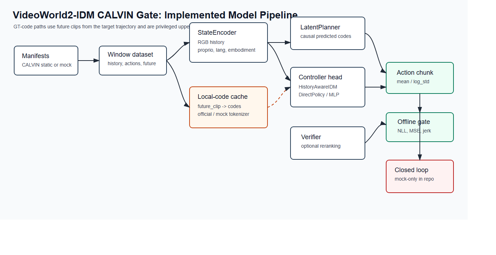
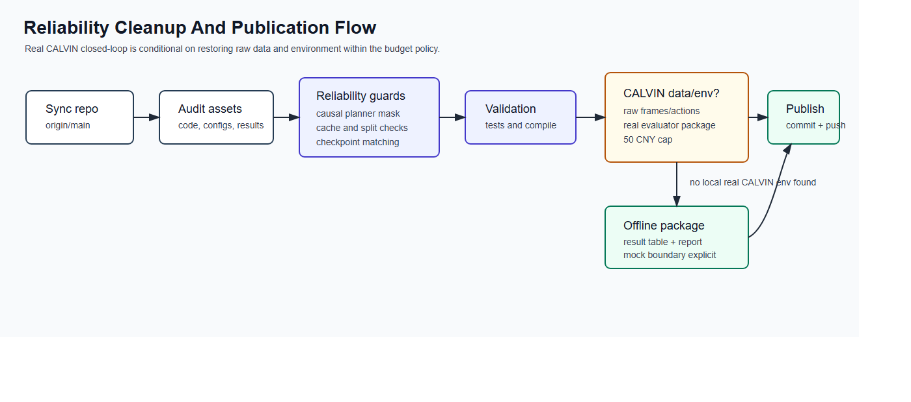

# VideoWorld2-IDM CALVIN Gate Experiments

A cleaned, publication-ready derivative of the official VideoWorld2 codebase, focused on the robot control experiments used to gate the `vw2_idm` line on CALVIN.

This repository packages the experiment code, configs, scripts, public reports, and lightweight result summaries. It does not version datasets, checkpoints, latent caches, or remote machine metadata.

## Highlights

- Keeps the `videoworld2/robot_idm` training and evaluation stack together with the `configs/vw2_idm` configs and the `scripts/` entrypoints used in the experiment cycle.
- Preserves the Phase 0 smoke-gate evidence and the Phase 1 offline CALVIN metrics in machine-readable files under [`results/`](results).
- Includes a public-ready status report in [`docs/reports/vw2_idm_gate_status_report.pdf`](docs/reports/vw2_idm_gate_status_report.pdf).
- Excludes large and sensitive artifacts by design: datasets, checkpoints, latent caches, remote instance metadata, and any local secrets.

## Visual Summary



The implemented `robot_idm` pipeline feeds windowed robot history through a state encoder and conditions controllers on either direct policy inputs, predicted latent codes, or privileged ground-truth future codes.



The current public gate is an offline CALVIN package plus mock closed-loop smoke evidence. A real fixed-episode CALVIN closed-loop evaluator is still absent.

The upstream VideoWorld2 figures are kept for attribution/context in [`assets/readme_figs/Fig1_final.png`](assets/readme_figs/Fig1_final.png) and [`assets/readme_figs/method_final.png`](assets/readme_figs/method_final.png).

## Repository Layout

```text
.
├── assets/                    # upstream figures used in documentation
├── configs/vw2_idm/          # smoke, CALVIN, planner, IDM, verifier configs
├── docs/
│   ├── reports/              # public PDF/TEX report
│   └── rescued_artifacts.md  # non-versioned artifact inventory
├── results/                  # lightweight experiment summaries committed to git
├── scripts/                  # extraction, training, eval, and debugging entrypoints
├── videoworld2/robot_idm/    # robot dataset, model, train, eval, and utils code
├── requirements.txt
└── LICENSE
```

## Installation

Use Python 3.11 and CUDA 12.4 compatible PyTorch, then install the project dependencies.

```bash
conda create -n videoworld2-idm python=3.11 -y
conda activate videoworld2-idm
pip install --upgrade pip
pip install torch==2.6.0 torchvision==0.21.0 torchaudio==2.6.0 --index-url https://download.pytorch.org/whl/cu124
pip install -r requirements.txt
bash install.sh
```

If you work on Windows, run the shell scripts through WSL or Git Bash.

## Data Preparation

This repository does not include raw CALVIN data or latent caches. Prepare them separately, then point the configs to your local paths.

1. Build CALVIN manifests and indexes.

```bash
python scripts/build_calvin_static_manifest.py --help
```

2. Set the manifest and cache paths in [`configs/vw2_idm/data_calvin_gate_4090.yaml`](configs/vw2_idm/data_calvin_gate_4090.yaml) or a local derivative.

3. Extract local future-dynamics codes.

```bash
bash scripts/extract_local_robot_codes.sh configs/vw2_idm/data_calvin_gate_4090.yaml
```

4. Place any required pretrained tokenizer or planner checkpoints outside git, then reference them from the config files.

The rescued checkpoint bundle from the original run is intentionally excluded from version control. See [`docs/rescued_artifacts.md`](docs/rescued_artifacts.md) for the artifact inventory.

## Usage

### Phase 0 smoke gate

```bash
python scripts/eval_oracle_replay.py --help
python scripts/overfit_smoke_bc.py --help
python scripts/overfit_smoke_idm.py --help
python scripts/debug_action_stats.py --help
```

### Phase 1 offline CALVIN gate

```bash
bash scripts/train_local_planner.sh configs/vw2_idm/planner_calvin_4090.yaml
python -m videoworld2.robot_idm.train.train_idm configs/vw2_idm/exp_bc_vis_calvin_4090.yaml
python -m videoworld2.robot_idm.train.train_idm configs/vw2_idm/exp_bc_vis_proprio_calvin_4090.yaml
python -m videoworld2.robot_idm.train.train_idm configs/vw2_idm/exp_pair_idm_calvin_4090.yaml
python -m videoworld2.robot_idm.train.train_idm configs/vw2_idm/exp_gt_code_idm_calvin_4090.yaml
python -m videoworld2.robot_idm.train.train_idm configs/vw2_idm/exp_vw2_hidden_mlp_action_head_calvin_4090.yaml
```

The `train_idm` entrypoint saves either an `idm` or `direct_policy` checkpoint according to the config. `policy.variant: mlp` and `idm.variant: bc` are direct-policy checkpoints and are validated as such during evaluation.

### Offline evaluation

```bash
python -m videoworld2.robot_idm.eval.eval_offline_idm configs/vw2_idm/exp_gt_code_idm_calvin_4090.yaml \
  --checkpoint path/to/best.pt \
  --output-json results/tmp_offline_eval.json
```

## Architecture and Experiment Notes

- `videoworld2/robot_idm/models/`
  contains the state encoder, history-aware IDM, latent planner, verifier, and direct policy baselines.
- `videoworld2/robot_idm/data/`
  contains the generic robot window dataset and the CALVIN static-camera loader.
- `videoworld2/robot_idm/eval/eval_closed_loop.py`
  is still mock-only in this snapshot. A real CALVIN closed-loop evaluator was requested later and is not implemented here yet.
- `videoworld2/robot_idm/eval/eval_offline_idm.py`
  includes the planner-load guard so GT-code runs do not incorrectly require a planner checkpoint.

## Results

### Phase 0 smoke gate

| Check | Result |
| --- | --- |
| Oracle replay | `100%` success on 24 validation episodes |
| BC overfit closed loop | `33.33%` success, offline MSE `0.00283` |
| History-IDM GT-code overfit closed loop | `16.67%` success, offline MSE `0.00346` |

Sanitized summaries are committed in [`results/phase0_summaries.json`](results/phase0_summaries.json).

### Phase 1 offline CALVIN gate

These numbers replace the earlier stale table after rerunning Phase 1 with the adapter path fix and the baseline architecture-selection fix.

| Controller | Action NLL | Action MSE | Jerk |
| --- | ---: | ---: | ---: |
| `VW2_hidden_mlp_action_head` | `0.02332` | `0.17899` | `0.00356026` |
| `History_IDM_GTcode` | `0.90677` | `0.17816` | `0.00000010` |
| `BC_vis` | `1.59221` | `0.18078` | `0.00000014` |
| `BC_vis_proprio` | `1.38503` | `0.19142` | `0.00000064` |
| `Pair_IDM_GTcode` | `1.38689` | `0.18394` | `0.00000206` |

Machine-readable metrics are committed in:

- [`results/phase1_offline_metrics.json`](results/phase1_offline_metrics.json)
- [`results/phase1_offline_metrics.csv`](results/phase1_offline_metrics.csv)
- [`results/phase1_controller_metadata.json`](results/phase1_controller_metadata.json)

`History_IDM_GTcode` and `Pair_IDM_GTcode` use ground-truth future latent codes from the target trajectory. They are privileged upper-bound checks, not deployable closed-loop policies.

### Current decision status

The artifact rescue is complete. The real CALVIN closed-loop adjudication is not complete in this snapshot. The current public report makes that boundary explicit:

- [`docs/reports/vw2_idm_gate_status_report.pdf`](docs/reports/vw2_idm_gate_status_report.pdf)
- [`docs/reports/vw2_idm_gate_status_report.tex`](docs/reports/vw2_idm_gate_status_report.tex)

## Validation

This cleaned repository is intended to pass lightweight syntax validation without running heavy training jobs:

```bash
python -m unittest tests.robot_idm.test_robot_idm -v
python -c "from pathlib import Path; import py_compile; [py_compile.compile(str(p), doraise=True) for p in list(Path('scripts').glob('*.py')) + list(Path('videoworld2/robot_idm').rglob('*.py'))]"
```

The exact command used during packaging is reported in the release notes from the upload session.

## Notes and Limitations

- The rescued CALVIN manifests referenced remote absolute dataset roots during the original run. This repository does not ship those manifests verbatim.
- No standalone action normalizer file existed in the rescued artifacts. Normalization remains a config-and-pipeline concern.
- `VW2_hidden_mlp_action_head_smooth` is not a separate trained checkpoint in this snapshot.
- The repository keeps the upstream VideoWorld2 code structure because the robot-control experiment depends on it.

## License

The code remains under the upstream Apache-2.0 license. See [`LICENSE`](LICENSE). Keep any additional attributions from [`ATTRIBUTIONS.md`](ATTRIBUTIONS.md) when redistributing derived work.
