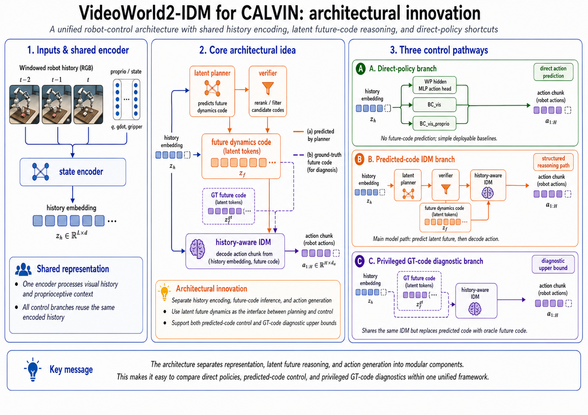

# VideoWorld2-IDM CALVIN Gate Experiments

A cleaned derivative of VideoWorld2 for CALVIN robot-control gate experiments. The repository keeps source code, configs, lightweight results, and the public report. It excludes datasets, checkpoints, latent caches, remote machine metadata, and secrets.

## Visual Summary



The architecture separates shared history encoding, future-code reasoning, and robot-action chunk generation across direct-policy, predicted-code IDM, and privileged GT-code diagnostic pathways.

## Included Files

- `videoworld2/robot_idm/`: robot-control datasets, models, train/eval code, and guards.
- `configs/vw2_idm/`: CALVIN, smoke, planner, IDM, verifier, and MLP action-head configs.
- `scripts/`: extraction, smoke-test, packaging, audit, and debug entrypoints.
- `results/`: committed lightweight summaries and provenance checks.
- `docs/reports/`: short public PDF/TEX gate report.

## Installation

Use Python 3.11 and CUDA 12.4 compatible PyTorch.

```bash
conda create -n videoworld2-idm python=3.11 -y
conda activate videoworld2-idm
pip install --upgrade pip
pip install torch==2.6.0 torchvision==0.21.0 torchaudio==2.6.0 --index-url https://download.pytorch.org/whl/cu124
pip install -r requirements.txt
bash install.sh
```

On Windows, run shell scripts through WSL or Git Bash.

## Data And Artifacts

Raw CALVIN data, checkpoints, and latent caches are not versioned. Prepare local paths in `configs/vw2_idm/data_calvin_gate_4090.yaml` or a private derivative.

```bash
python scripts/build_calvin_static_manifest.py --help
bash scripts/extract_local_robot_codes.sh configs/vw2_idm/data_calvin_gate_4090.yaml
```

The rescued remote-run bundle remains outside git. Its public inventory is in `docs/rescued_artifacts.md`; the current source of truth is `results/phase1_result_provenance.json` plus `results/rescued_artifact_audit.json`.

## Usage

Smoke checks:

```bash
python scripts/eval_oracle_replay.py --help
python scripts/overfit_smoke_bc.py --help
python scripts/overfit_smoke_idm.py --help
python scripts/debug_action_stats.py --help
```

Phase 1 offline CALVIN training:

```bash
bash scripts/train_local_planner.sh configs/vw2_idm/planner_calvin_4090.yaml
python -m videoworld2.robot_idm.train.train_idm configs/vw2_idm/exp_bc_vis_calvin_4090.yaml
python -m videoworld2.robot_idm.train.train_idm configs/vw2_idm/exp_bc_vis_proprio_calvin_4090.yaml
python -m videoworld2.robot_idm.train.train_idm configs/vw2_idm/exp_pair_idm_calvin_4090.yaml
python -m videoworld2.robot_idm.train.train_idm configs/vw2_idm/exp_gt_code_idm_calvin_4090.yaml
python -m videoworld2.robot_idm.train.train_idm configs/vw2_idm/exp_vw2_hidden_mlp_action_head_calvin_4090.yaml
```

Offline evaluation:

```bash
python -m videoworld2.robot_idm.eval.eval_offline_idm configs/vw2_idm/exp_gt_code_idm_calvin_4090.yaml \
  --checkpoint path/to/best.pt \
  --output-json results/tmp_offline_eval.json
```

## Results

The current decision is **Hold**. This repository has offline CALVIN metrics and mock closed-loop smoke tests, but no real CALVIN closed-loop adjudication.

Phase 1 audited offline CALVIN gate:

| Controller | Action NLL | Action MSE | Jerk | Interpretation |
| --- | ---: | ---: | ---: | --- |
| `VW2_hidden_mlp_action_head` | `-0.05002` | `0.08925` | `0.00671523` | deployable direct MLP policy |
| `BC_vis_proprio` | `0.72483` | `0.21353` | `0.00000368` | deployable direct visual+proprio policy |
| `History_IDM_GTcode` | `0.99295` | `0.15558` | `0.00000764` | privileged GT-code diagnostic |
| `Pair_IDM_GTcode` | `1.01428` | `0.23940` | `0.00000024` | privileged GT-code diagnostic |
| `BC_vis` | `1.23764` | `0.18699` | `0.00000009` | deployable direct visual policy |

Phase 0 mock smoke:

| Check | Result | Use |
| --- | --- | --- |
| Oracle replay | `100%` success on 24 validation episodes | synthetic oracle sanity check |
| BC overfit closed loop | `33.33%` success, offline MSE `0.00283` | synthetic policy smoke test |
| History-IDM GT-code overfit | `16.67%` success, offline MSE `0.00346` | privileged diagnostic smoke test |

Machine-readable results:

- `results/phase0_summaries.json`
- `results/phase0_rollout_metadata.json`
- `results/phase1_offline_metrics.json`
- `results/phase1_offline_metrics.csv`
- `results/phase1_controller_metadata.json`
- `results/phase1_result_provenance.json`
- `results/rescued_artifact_audit.json`

Public report:

- `docs/reports/vw2_idm_gate_status_report.pdf`
- `docs/reports/vw2_idm_gate_status_report.tex`

## Reliability Guards

- Planner masking prevents teacher-forced future-token leakage.
- Cache and manifest guards validate split identity, window payloads, latent-cache keys, tokenizer coverage, and CALVIN frame-span overlap.
- Checkpoint guards validate controller architecture, conditioning mode, planner/teacher identity, and path resolution before load.
- Result packaging records provenance, privilege/deployability flags, metric origin, and non-finite metric checks.

## Limits

- `eval_closed_loop.py` is mock-only in this snapshot.
- No standalone action normalizer was recovered.
- `VW2_hidden_mlp_action_head_smooth` is not a separate trained checkpoint here.
- Fresh real-CALVIN adjudication still needs raw CALVIN data, a complete tokenizer checkpoint, and fixed-episode closed-loop evaluation with identical starts, instructions, camera pipeline, action normalization, clipping, and timeouts.

## Validation

```bash
python -m unittest tests.robot_idm.test_robot_idm -v
python -c "from pathlib import Path; import py_compile; [py_compile.compile(str(p), doraise=True) for p in list(Path('scripts').glob('*.py')) + list(Path('videoworld2/robot_idm').rglob('*.py'))]"
```

## License

The code remains under the upstream Apache-2.0 license. See `LICENSE` and keep `ATTRIBUTIONS.md` when redistributing derived work.
